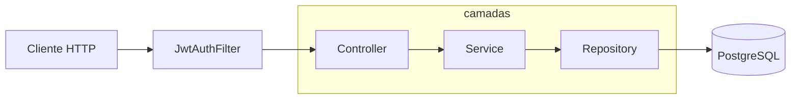

# Finance API — Plano de Desenvolvimento (MVP)

## Cabeçalho

| Item | Detalhe |
|------|---------|
| **Projeto** | Finance API — API REST para controle financeiro pessoal (despesas, credores, categorias) |
| **Objetivo do MVP** | Entregar autenticação multi-usuário com isolamento de dados, CRUD completo dos recursos da spec e documentação para uso local |
| **Fonte da verdade** | [`doc/domain-and-api.yaml`](./domain-and-api.yaml) — modelo de domínio, regras de negócio e contratos REST |
| **Fora do MVP** | Modelo de empréstimo/financiamento (seção *Future* da spec) |
| **Decisão de segurança** | A spec cita BCrypt; **neste projeto usamos Argon2** via `Argon2PasswordEncoder` do Spring Security (mais resistente a ataques com GPU; suporte nativo no Spring Security 6+) |

### Stack

| Camada | Tecnologia |
|--------|------------|
| Runtime | Java 17 |
| Framework | Spring Boot 4.1.0 |
| Build | Maven (wrapper: `.\mvnw.cmd`) |
| Persistência | Spring Data JPA + PostgreSQL 16 |
| Segurança | Spring Security + Argon2 + JWT |
| Validação | Bean Validation (`jakarta.validation`) |
| Documentação API | springdoc-openapi (etapa 9) |
| Migrations | Flyway (etapa 0) |
| Testes | JUnit 5, Mockito, Spring Security Test, `@WebMvcTest` |

### Pré-requisitos do desenvolvedor

- [ ] JDK 17 instalado (`java -version`)
- [ ] Docker Desktop (ou engine compatível) para subir o PostgreSQL
- [ ] Editor com suporte a Java (IntelliJ IDEA recomendado)
- [ ] Cliente HTTP (curl, Postman, Insomnia ou Swagger UI na etapa 9)
- [ ] Conceitos básicos de HTTP (verbos, status code, JSON)

### Estado atual do repositório

O projeto contém apenas o bootstrap:

- `FinanceApiApplication` — classe principal
- `application.properties` — somente `spring.application.name`
- `FinanceApiApplicationTests` — teste de contexto vazio (`contextLoads`)
- `pom.xml` — WebMvc, JPA, Security, Validation, PostgreSQL, Lombok, DevTools e starters de teste
- `docker-compose.yaml` — PostgreSQL 16 na porta `5432`, database `finance-api`, user/senha `postgres`

---

## Visão geral

### Arquitetura em camadas

Cada responsabilidade fica em um pacote separado. Isso facilita testes, manutenção e evita que regras de negócio “vazem” para o controller.

```
com.jaconis.finance_api
├── config/          # Beans de segurança, JWT, OpenAPI, JPA auditing
├── domain/          # Entidades JPA e enums (ExpenseType, PaymentMethod)
├── repository/      # Interfaces Spring Data JPA
├── service/         # Regras de negócio e orquestração
├── controller/      # Endpoints REST (finos — delegam ao service)
├── dto/
│   ├── request/     # Payloads de entrada + Bean Validation
│   └── response/    # Payloads de saída (nunca expor entidade)
└── exception/       # Exceções de domínio + @ControllerAdvice
```

**Por que separar DTO de Entity?** A entidade reflete o banco (campos internos como `passwordHash`). O DTO reflete o contrato da API. Misturar os dois expõe dados sensíveis e acopla a API ao schema do banco.

### Fluxo de uma requisição autenticada

```
Cliente HTTP
    │
    ▼
Security Filter Chain  ──► valida JWT, extrai userId, popula SecurityContext
    │
    ▼
Controller             ──► recebe DTO, chama Service
    │
    ▼
Service                ──► regras de negócio, valida FKs, calcula totalAmount
    │
    ▼
Repository             ──► consulta/persiste no PostgreSQL (sempre filtrando por userId)
    │
    ▼
PostgreSQL
```

### Diagrama (mermaid)



### Princípios que valem em todas as etapas

1. **`userId` vem do JWT** — nunca aceitar `userId` no body ou query para escopo de dados.
2. **Isolamento multi-tenant por usuário** — todo `findById` em recurso do usuário usa `findByIdAndUserId`.
3. **Senha com Argon2** — campo `passwordHash` na entidade; nunca retornar senha ou hash na API.
4. **`totalAmount` de Expense é calculado** — `installmentCount * installmentAmount`; não persistir.
5. **DELETE com proteção** — Creditor, Category e FinancialResponsible não podem ser excluídos se referenciados por Expense.

---

## Etapas numeradas

---

### Etapa 0 — Configuração base (PostgreSQL, properties, pacotes, Flyway)

| Campo | Conteúdo |
|-------|----------|
| **Objetivo** | Aplicação conecta ao PostgreSQL via Docker, estrutura de pacotes criada e migrations versionadas com Flyway |
| **Pré-requisitos** | Docker instalado; entender o que é `application.properties` |
| **Conceitos para aprender** | **DataSource** — pool de conexões JDBC; **Flyway** — versionamento de schema SQL; **ddl-auto** — por que `validate` ou `none` com Flyway (não `create-drop` em produção); **profiles** — `application-dev.properties` opcional |
| **Tarefas** | - [ ] Subir PostgreSQL: `docker compose up -d` na raiz do projeto<br>- [ ] Configurar `application.properties`: URL JDBC (`jdbc:postgresql://localhost:5432/finance-api`), usuário/senha, dialect Hibernate<br>- [ ] Definir `spring.jpa.hibernate.ddl-auto=validate` (Flyway cria o schema)<br>- [ ] Adicionar dependência `spring-boot-starter-flyway` no `pom.xml`<br>- [ ] Criar estrutura de pacotes vazia: `config`, `domain`, `repository`, `service`, `controller`, `dto/request`, `dto/response`, `exception`<br>- [ ] Criar migration inicial vazia ou com extensão `pgcrypto` se for usar `gen_random_uuid()` — ou usar UUID gerado pela aplicação<br>- [ ] Habilitar JPA Auditing (`@EnableJpaAuditing`) para `createdAt`/`updatedAt` (bean em `config`) |
| **Arquivos/pacotes** | `src/main/resources/application.properties`<br>`src/main/resources/db/migration/V1__*.sql` (placeholder ou tabelas na etapa 1)<br>`pom.xml` (Flyway)<br>Pacotes em `src/main/java/com/jaconis/finance_api/` |
| **Libs novas** | **Flyway** (`org.flywaydb:flyway-database-postgresql` transitivo via starter) — migrations versionadas e reproduzíveis em qualquer ambiente.<br>**Alternativa descartada:** `ddl-auto=update` — conveniente no início, mas schema imprevisível e difícil de revisar em PR. |
| **Como validar** | `docker compose ps` — container `postgres` healthy<br>`.\mvnw.cmd spring-boot:run` — sobe sem erro de conexão<br>`.\mvnw.cmd test` — `contextLoads` continua passando |
| **Definition of Done** | App inicia conectada ao banco; pacotes criados; Flyway executa sem erro; README ainda pode estar vazio |
| **Erros comuns** | Esquecer de subir o Docker antes da app → `Connection refused`<br>`ddl-auto=create` + Flyway conflitando — escolha um dono do schema<br>URL JDBC com nome de database errado (`finance-api` vs `finance_api`) |
| **Perguntas de revisão** | Por que não deixamos o Hibernate criar tabelas automaticamente em produção?<br>O que acontece se você alterar uma migration já aplicada?<br>Qual a diferença entre `application.properties` e variáveis de ambiente? |

---

### Etapa 1 — Primeira entidade e repository (User)

| Campo | Conteúdo |
|-------|----------|
| **Objetivo** | Entidade `User` persistida no PostgreSQL com repository funcional |
| **Pré-requisitos** | Etapa 0 concluída |
| **Conceitos para aprender** | **Entity** (`@Entity`, `@Table`, `@Id`); **UUID** como chave primária; **@Column** e constraints (`unique` em email); **Spring Data JPA Repository** (`JpaRepository<User, UUID>`); **Auditing** (`@CreatedDate`, `@LastModifiedDate`); diferença entre campo `password` (transiente no registro) e `passwordHash` (persistido) |
| **Tarefas** | - [ ] Criar entidade `User` conforme spec: `id`, `email`, `passwordHash`, `createdAt`, `updatedAt`<br>- [ ] Migration Flyway `V*__create_users.sql` com tabela `users` e índice único em `email`<br>- [ ] Criar `UserRepository extends JpaRepository<User, UUID>` com `Optional<User> findByEmail(String email)`<br>- [ ] Configurar geração de UUID (`@GeneratedValue` ou `@PrePersist`)<br>- [ ] (Opcional) teste de integração `@DataJpaTest` salvando e buscando um user |
| **Arquivos/pacotes** | `domain/User.java`<br>`repository/UserRepository.java`<br>`db/migration/V*__create_users.sql`<br>`config/JpaAuditingConfig.java` |
| **Libs novas** | Nenhuma — JPA e PostgreSQL já estão no `pom.xml` |
| **Como validar** | `.\mvnw.cmd test`<br>Inspecionar tabela no banco: `docker compose exec postgres psql -U postgres -d finance-api -c "\dt"`<br>App sobe com `ddl-auto=validate` sem erro de schema |
| **Definition of Done** | Tabela `users` existe; repository salva e busca por email; `passwordHash` é coluna no banco, não `password` |
| **Erros comuns** | Nome de tabela reservado — usar `users` explicitamente<br>Esquecer `@Entity` ou pacote fora do scan do Spring<br>Expor `passwordHash` em JSON antes de ter DTOs (corrigido na etapa 2) |
| **Perguntas de revisão** | Por que o email é único globalmente e não por `userId`?<br>Qual a diferença entre `JpaRepository` e escrever SQL manual?<br>Por que não persistimos a senha em texto plano? |

---

### Etapa 2 — DTOs e Bean Validation

| Campo | Conteúdo |
|-------|----------|
| **Objetivo** | Padronizar entrada/saída da API com DTOs validados, sem expor entidades JPA |
| **Pré-requisitos** | Etapa 1 |
| **Conceitos para aprender** | **DTO** (Data Transfer Object); anotações `@NotBlank`, `@Email`, `@Size`, `@Min`, `@Positive`; `@Valid` no controller; **record** vs classe para DTOs imutáveis; mapper manual (método estático ou componente) vs MapStruct (futuro — MVP usa manual) |
| **Tarefas** | - [ ] Criar `RegisterRequest` (email, password) com validações<br>- [ ] Criar `UserResponse` (id, email, createdAt) — **sem** password/hash<br>- [ ] Criar `LoginRequest` (email, password)<br>- [ ] Criar `AuthResponse` ou `TokenResponse` (token, opcionalmente dados mínimos do user)<br>- [ ] Criar classe utilitária ou métodos `toEntity` / `toResponse` no service (não no controller)<br>- [ ] Documentar convenção: requests em `dto/request`, responses em `dto/response` |
| **Arquivos/pacotes** | `dto/request/RegisterRequest.java`, `LoginRequest.java`<br>`dto/response/UserResponse.java`, `TokenResponse.java` |
| **Libs novas** | Nenhuma — `spring-boot-starter-validation` já presente |
| **Como validar** | Compilação: `.\mvnw.cmd compile`<br>Teste manual posterior na etapa 4 com payload inválido → 400 (após etapa 3) |
| **Definition of Done** | DTOs criados com validações; nenhum endpoint público ainda obrigatório; entidade `User` não aparece em assinaturas de API planejadas |
| **Erros comuns** | Validar DTO mas esquecer `@Valid` no `@RequestBody`<br>Colocar `userId` no DTO de criação — **proibido** pela spec<br>Retornar entidade diretamente no controller |
| **Perguntas de revisão** | Por que validamos no DTO e não só no banco?<br>Qual campo nunca deve aparecer em um Response DTO?<br>Records são obrigatórios? Quando usar classe? |

---

### Etapa 3 — Tratamento global de erros (`@ControllerAdvice`)

| Campo | Conteúdo |
|-------|----------|
| **Objetivo** | Respostas de erro consistentes em JSON para toda a API |
| **Pré-requisitos** | Etapa 2 |
| **Conceitos para aprender** | **`@ControllerAdvice`** + **`@ExceptionHandler`**; **`ProblemDetail`** (RFC 7807, Spring 6+); mapeamento exceção → HTTP status; `MethodArgumentNotValidException` (Bean Validation); exceções de domínio (`ResourceNotFoundException`, `BusinessRuleException`) |
| **Tarefas** | - [ ] Criar `ApiExceptionHandler` em `exception/`<br>- [ ] Tratar validação → `400 Bad Request` com lista de campos<br>- [ ] Tratar `ResourceNotFoundException` → `404`<br>- [ ] Tratar `BusinessRuleException` (ex.: delete bloqueado) → `409 Conflict` ou `400` (documentar escolha)<br>- [ ] Tratar credenciais inválidas (etapa 4) → `401 Unauthorized`<br>- [ ] Padronizar corpo: `timestamp`, `status`, `error`, `message`, `path` (ou `ProblemDetail` puro)<br>- [ ] Criar exceções base em `exception/` |
| **Arquivos/pacotes** | `exception/ApiExceptionHandler.java`<br>`exception/ResourceNotFoundException.java`<br>`exception/BusinessRuleException.java` |
| **Libs novas** | Nenhuma |
| **Como validar** | Após etapa 4: registrar user com email inválido → JSON de erro estruturado<br>`.\mvnw.cmd test` |
| **Definition of Done** | Nenhuma exceção não tratada retorna stack trace ao cliente; formato de erro único em toda a API |
| **Erros comuns** | Capturar `Exception` genérica e engolir a causa real nos logs<br>Retornar `500` para erro de validação (`400` é o correto)<br>Esquecer de logar a exceção no servidor |
| **Perguntas de revisão** | Qual a diferença entre 404 e 403 em um `GET /creditors/{id}` de outro usuário? (Decisão: 404 evita vazar existência — discutir com o time.)<br>Por que centralizar erros em vez de try/catch em cada controller? |

---

### Etapa 4 — Autenticação: register, login, Argon2 e JWT

| Campo | Conteúdo |
|-------|----------|
| **Objetivo** | Endpoints públicos de registro e login; rotas protegidas exigem JWT; senha com Argon2; seed de dados iniciais no registro |
| **Pré-requisitos** | Etapas 1–3 |
| **Conceitos para aprender** | **Spring Security Filter Chain**; **stateless** vs sessão; **JWT** (header.payload.signature); **PasswordEncoder**; **Argon2** vs BCrypt; **SecurityContext** e `Authentication`; **CORS** básico se necessário para frontend futuro |
| **Tarefas** | - [ ] Adicionar dependência JWT (ver Libs novas)<br>- [ ] Bean `PasswordEncoder` → `Argon2PasswordEncoder.defaultsForSpringSecurity_v5_8()` (**não** BCrypt da spec original)<br>- [ ] `AuthService`: register (hash senha, salvar user), login (verificar senha, emitir JWT)<br>- [ ] No register: seed das 6 categorias iniciais (Casa, Educação, Lazer, Transporte, Saúde, Outros) e 1 `FinancialResponsible` com nome padrão "Titular"<br>- [ ] `JwtService`: gerar token com `subject` = userId (ou email + claim `userId`); validar expiração e assinatura<br>- [ ] `JwtAuthenticationFilter` antes de `UsernamePasswordAuthenticationFilter`<br>- [ ] `SecurityConfig`: `POST /api/v1/auth/register` e `login` públicos; demais `/api/v1/**` autenticados; `SessionCreationPolicy.STATELESS`<br>- [ ] `AuthController`: `POST /api/v1/auth/register`, `POST /api/v1/auth/login`<br>- [ ] Helper `SecurityUtils.getCurrentUserId()` lendo do SecurityContext<br>- [ ] Criar entidades/repositories mínimos de `Category` e `FinancialResponsible` **somente** para o seed (CRUD completo vem nas etapas 6–7)<br>- [ ] Documentar no código/comentário: Argon2 escolhido em vez de BCrypt |
| **Arquivos/pacotes** | `config/SecurityConfig.java`, `config/JwtAuthenticationFilter.java`<br>`service/AuthService.java`, `service/JwtService.java`<br>`controller/AuthController.java`<br>`domain/Category.java`, `domain/FinancialResponsible.java` (mínimo)<br>`repository/CategoryRepository.java`, `FinancialResponsibleRepository.java`<br>Migrations para `categories`, `financial_responsibles` |
| **Libs novas** | **JJWT** (`io.jsonwebtoken:jjwt-api`, `jjwt-impl`, `jjwt-jackson` — runtime) — biblioteca madura, ampla documentação para Spring Boot + JWT manual.<br>**Alternativa descartada:** Spring Authorization Server — poderoso demais para login simples email/senha; curva de aprendizado alta.<br>**Alternativa descartada:** Sessão HTTP — spec exige JWT; não escala igual em APIs stateless. |
| **Como validar** | `docker compose up -d`<br>`.\mvnw.cmd spring-boot:run`<br>Registrar usuário (curl/Postman):<br>`Invoke-RestMethod -Method Post -Uri http://localhost:8080/api/v1/auth/register -ContentType "application/json" -Body '{"email":"a@b.com","password":"senha123"}'`<br>Login e copiar token<br>Chamar endpoint protegido sem token → `401`<br>Com `Authorization: Bearer <token>` → `200` (quando CRUD existir) |
| **Definition of Done** | Register cria user + categorias + financial responsible padrão; login retorna JWT; senha armazenada com Argon2; `userId` disponível no service via SecurityContext |
| **Erros comuns** | Colocar segredo JWT fixo no código — usar `application.properties` ou env var<br>Esquecer de liberar `/auth/**` no SecurityConfig → register retorna 401<br>Confundir `sub` do JWT com email quando o filtro espera UUID |
| **Perguntas de revisão** | Por que JWT stateless em vez de sessão no servidor?<br>O que impede um usuário de alterar o `userId` no body da requisição?<br>Por que Argon2 é preferível ao BCrypt hoje? |

---

### Etapa 5 — Primeiro teste unitário (Service + Mockito)

| Campo | Conteúdo |
|-------|----------|
| **Objetivo** | Validar lógica de negócio isolada sem subir o Spring Context completo (ou com contexto mínimo) |
| **Pré-requisitos** | Etapa 4 (ex.: `AuthService` ou service de Category da etapa 6 — pode começar com `AuthService`) |
| **Conceitos para aprender** | **Teste unitário** — uma unidade, dependências mockadas; **Mockito** — `@Mock`, `@InjectMocks`, `when().thenReturn()`; **`@ExtendWith(MockitoExtension.class)`**; diferença para `@SpringBootTest` (integração); **AAA** — Arrange, Act, Assert |
| **Tarefas** | - [ ] Criar `AuthServiceTest` (ou `CategoryServiceTest` se etapa 6 já iniciada)<br>- [ ] Caso: register com email duplicado → exceção esperada<br>- [ ] Caso: login com senha errada → exceção / Optional vazio<br>- [ ] Caso: login com credenciais válidas → token não nulo (mockar `JwtService`)<br>- [ ] Usar `ArgumentCaptor` opcional para verificar que `passwordEncoder.encode` foi chamado<br>- [ ] `.\mvnw.cmd test` no CI local |
| **Arquivos/pacotes** | `src/test/java/.../service/AuthServiceTest.java` |
| **Libs novas** | Nenhuma — Mockito vem com `spring-boot-starter-*-test` |
| **Como validar** | `.\mvnw.cmd test` — todos verdes<br>Teste falha se remover validação de email duplicado (prova que testa comportamento real) |
| **Definition of Done** | Pelo menos 3 cenários no service; sem dependência de PostgreSQL; execução < 1s para a classe |
| **Erros comuns** | `@SpringBootTest` para tudo — lento e desnecessário para regra pura<br>Mockar a classe sob teste em vez das dependências<br>Testar getter/setter sem comportamento |
| **Perguntas de revisão** | O que você mocka e o que deixa real em um teste unitário de service?<br>Por que testes unitários devem rodar sem Docker? |

---

### Etapa 6 — CRUD Categories (modelo para replicar)

| Campo | Conteúdo |
|-------|----------|
| **Objetivo** | CRUD completo de categorias com isolamento por `userId` — **template** para credores e responsáveis |
| **Pré-requisitos** | Etapas 4–5; entidade `Category` já existe do seed |
| **Conceitos para aprender** | **REST** verbos e idempotência; **PUT vs PATCH**; repository `findByIdAndUserId`; **IDOR** — por que não usar só `findById`; paginação (opcional no MVP — lista simples) |
| **Tarefas** | - [ ] Completar entidade `Category` se necessário (`name`, `description`, `userId`)<br>- [ ] DTOs: `CategoryRequest`, `CategoryResponse`, `CategoryPatchRequest`<br>- [ ] `CategoryRepository`: `findAllByUserId`, `findByIdAndUserId`, `existsByNameAndUserId`<br>- [ ] `CategoryService`: CRUD filtrando por `getCurrentUserId()`<br>- [ ] `CategoryController` em `/api/v1/categories` — GET lista, GET `{id}`, POST, PUT, PATCH, DELETE<br>- [ ] DELETE: verificar se categoria é referenciada por `Expense` — na etapa 8; por ora deixar método preparado ou stub que será completado<br>- [ ] Validação: `name` obrigatório; unicidade por user (opcional na spec — implementar se simples)<br>- [ ] Testes unitários: criar categoria, buscar de outro userId → not found |
| **Arquivos/pacotes** | `domain/Category.java`, `repository/CategoryRepository.java`<br>`service/CategoryService.java`, `controller/CategoryController.java`<br>`dto/request|response` para Category |
| **Libs novas** | Nenhuma |
| **Como validar** | Com JWT do usuário A: criar e listar categorias (inclui seeds do registro)<br>Usuário B não vê categorias de A<br>`.\mvnw.cmd test` |
| **Definition of Done** | Todos os endpoints de `categories` da spec funcionam; `userId` nunca vem do client; padrão repository/service/controller documentado mentalmente para copiar |
| **Erros comuns** | `findById(id)` sem `userId` — vulnerabilidade IDOR<br>Retornar `403` vs `404` — padronizar com o time (recomendado: 404)<br>Esquecer `@Transactional` em operações de escrita no service |
| **Perguntas de revisão** | Como o padrão desta etapa se repete em Creditors?<br>Por que o DELETE de categoria pode falhar depois da etapa 8? |

---

### Etapa 7 — CRUD Creditors e Financial Responsibles

| Campo | Conteúdo |
|-------|----------|
| **Objetivo** | Dois CRUDs completos seguindo o modelo da etapa 6 |
| **Pré-requisitos** | Etapa 6 |
| **Conceitos para aprender** | Reuso de padrão; **dueDay** em Creditor (dia de vencimento, 1–31); validação `@Min(1) @Max(31)`; relacionamento conceitual Creditor → Expenses (sem JPA bidirecional obrigatório no MVP) |
| **Tarefas** | - [ ] Entidade `Creditor`: `id`, `userId`, `name`, `dueDay`, auditing<br>- [ ] Migration `creditors`<br>- [ ] CRUD `/api/v1/creditors` — espelhar Category<br>- [ ] Entidade `FinancialResponsible` completa se ainda mínima<br>- [ ] CRUD `/api/v1/financial-responsibles`<br>- [ ] DELETE em ambos: bloquear se existir `Expense` referenciando (implementação final na etapa 8 — pode lançar `BusinessRuleException`)<br>- [ ] Testes unitários: delete bloqueado quando repository de expense retorna `existsBy...` true |
| **Arquivos/pacotes** | `domain/Creditor.java`, `domain/FinancialResponsible.java`<br>`repository/`, `service/`, `controller/` para cada<br>DTOs correspondentes |
| **Libs novas** | Nenhuma |
| **Como validar** | CRUD via HTTP com JWT<br>Dois usuários isolados<br>`.\mvnw.cmd test` |
| **Definition of Done** | Endpoints `creditors` e `financial-responsibles` da spec OK; `dueDay` persistido em Creditor |
| **Erros comuns** | Esquecer `dueDay` (está no schema da spec, não só no bullet de features)<br>Duplicar código sem ao menos seguir o mesmo padrão de nomes<br>Permitir DELETE sem checagem de referência |
| **Perguntas de revisão** | Qual a diferença entre Creditor e FinancialResponsible no domínio?<br>Como garantir que um creditorId no Expense pertence ao usuário logado? |

---

### Etapa 8 — CRUD Expenses e regras de negócio

| Campo | Conteúdo |
|-------|----------|
| **Objetivo** | Recurso central da API com enums, FKs validadas, `totalAmount` calculado e DELETE protegido nos relacionados |
| **Pré-requisitos** | Etapa 7 |
| **Conceitos para aprender** | **Enums JPA** (`@Enumerated(STRING)`); **BigDecimal** para dinheiro; **@ManyToOne** opcional vs só `UUID` FK; validação cross-entity no service; **filtros** em GET (`categoryId`, `expenseType`, `paymentMethod`, `financialResponsibleId`) |
| **Tarefas** | - [ ] Enums `ExpenseType` (FIXA, VARIAVEL) e `PaymentMethod` (CARTAO, PIX, BOLETO, TED, FINANCIAMENTO)<br>- [ ] Entidade `Expense` conforme spec — **sem** campo `totalAmount` persistido<br>- [ ] Migration `expenses` com FKs para creditor, category, financial_responsible<br>- [ ] DTOs: `ExpenseRequest`, `ExpenseResponse` com `totalAmount` calculado, `ExpensePatchRequest`<br>- [ ] `ExpenseService`: validar `installmentCount >= 1`, `installmentAmount > 0`<br>- [ ] Antes de salvar: creditor, category e financialResponsible existem **e** pertencem ao `userId` atual<br>- [ ] `ExpenseRepository`: queries com `userId`; métodos `existsByCreditorId`, `existsByCategoryId`, `existsByFinancialResponsibleId` para bloqueio de DELETE<br>- [ ] Completar DELETE em Category, Creditor, FinancialResponsible usando esses exists<br>- [ ] `GET /api/v1/expenses` com query params opcionais de filtro<br>- [ ] Response inclui nomes legíveis se útil (ex.: `creditorName`) — opcional mas ajuda o frontend<br>- [ ] Testes unitários: totalAmount; FK de outro usuário → erro; delete creditor referenciado → Conflict |
| **Arquivos/pacotes** | `domain/Expense.java`, `domain/ExpenseType.java`, `domain/PaymentMethod.java`<br>`repository/ExpenseRepository.java`<br>`service/ExpenseService.java`<br>`controller/ExpenseController.java`<br>DTOs de Expense |
| **Libs novas** | Nenhuma |
| **Como validar** | Fluxo completo: register → criar creditor → criar expense → GET com filtros<br>Tentar DELETE creditor com expense → erro de negócio<br>`.\mvnw.cmd test` |
| **Definition of Done** | Todos endpoints `expenses` da spec; regras de installment e FKs; deletes protegidos; `totalAmount` só em response |
| **Erros comuns** | Usar `double` para dinheiro — usar `BigDecimal`<br>Persistir `totalAmount` — viola spec<br>Validar FK só por existência, não por `userId` |
| **Perguntas de revisão** | Onde o `totalAmount` é calculado e por que não no banco?<br>O que acontece se `installmentCount` for 0? |

---

### Etapa 9 — Swagger / OpenAPI (springdoc)

| Campo | Conteúdo |
|-------|----------|
| **Objetivo** | Documentação interativa da API com autenticação Bearer JWT |
| **Pré-requisitos** | Etapas 4 e 6–8 (endpoints existentes) |
| **Conceitos para aprender** | **OpenAPI 3** — contrato da API; **Swagger UI** — interface web; `@Operation`, `@Schema`; **security scheme** Bearer JWT |
| **Tarefas** | - [ ] Adicionar `springdoc-openapi-starter-webmvc-ui` (versão compatível com Spring Boot 4)<br>- [ ] `OpenApiConfig`: título, versão, descrição; scheme `bearerAuth` JWT<br>- [ ] Liberar `/swagger-ui/**` e `/v3/api-docs/**` no Security (apenas dev ou com cuidado em prod)<br>- [ ] Anotar controllers principais com resumo e tags (Auth, Categories, …)<br>- [ ] Garantir que DTOs aparecem nos schemas (nomes claros)<br>- [ ] Testar fluxo: Authorize → colar token → chamar GET `/api/v1/categories` |
| **Arquivos/pacotes** | `config/OpenApiConfig.java`<br>`pom.xml`<br>Anotações nos controllers |
| **Libs novas** | **springdoc-openapi-starter-webmvc-ui** (`org.springdoc:springdoc-openapi-starter-webmvc-ui`) — mantido ativamente para Spring Boot 3/4; gera UI em `/swagger-ui.html`.<br>**Alternativa descartada:** Springfox — incompatível com Jakarta EE / Spring Boot 3+. |
| **Como validar** | `.\mvnw.cmd spring-boot:run`<br>Navegar: `http://localhost:8080/swagger-ui.html`<br>Register + Login via Swagger → Authorize → endpoints protegidos |
| **Definition of Done** | Todos os endpoints MVP documentados; JWT configurável no UI; schemas refletem DTOs |
| **Erros comuns** | Esquecer security scheme → endpoints protegidos falham no UI<br>Expor Swagger em produção sem restrição — discutir com o time<br>Versão springdoc incompatível com Boot 4 — checar matriz de compatibilidade |
| **Perguntas de revisão** | Qual a diferença entre OpenAPI e Swagger?<br>Por que documentamos DTOs e não Entities? |

---

### Etapa 10 — Testes adicionais (`@WebMvcTest` e segurança)

| Campo | Conteúdo |
|-------|----------|
| **Objetivo** | Testar camada web e regras de segurança sem integração completa com banco |
| **Pré-requisitos** | Etapas 4–9 |
| **Conceitos para aprender** | **`@WebMvcTest`** — só camada MVC; **`@MockBean`** — substituir services; **`MockMvc`** — `perform(get(...))`; **`@WithMockUser`** vs JWT real; **Spring Security Test** — `csrf`, `authorizeHttpRequests` |
| **Tarefas** | - [ ] `CategoryControllerTest` com `@WebMvcTest(CategoryController.class)`<br>- [ ] Mockar `CategoryService`; verificar status e JSON<br>- [ ] Teste: sem autenticação → `401`<br>- [ ] Teste: com `@WithMockUser` ou importar config de segurança de teste<br>- [ ] `AuthControllerTest`: register válido → `201`/`200`; payload inválido → `400`<br>- [ ] (Opcional) `@DataJpaTest` para query `findByIdAndUserId`<br>- [ ] Manter pirâmide: mais unitários, menos integração lenta |
| **Arquivos/pacotes** | `src/test/java/.../controller/*Test.java`<br>`src/test/java/.../security/` se necessário |
| **Libs novas** | Nenhuma — `spring-boot-starter-security-test` já no `pom.xml` |
| **Como validar** | `.\mvnw.cmd test`<br>Cobertura manual: principais fluxos e regras de segurança |
| **Definition of Done** | Pelo menos 1 `@WebMvcTest` por grupo de controller; testes de 401 em rotas protegidas; suite completa verde |
| **Erros comuns** | `@WebMvcTest` carregar `@SpringBootTest` inteiro — lento e frágil<br>Não importar `SecurityConfig` no teste e obter 403 inesperado<br>Testar JSON sem `jsonPath` e miss assertions |
| **Perguntas de revisão** | Quando usar `@WebMvcTest` em vez de teste unitário de service?<br>Por que mockamos o service no teste de controller? |

---

### Etapa 11 — Documentação (README e Javadoc seletivo)

| Campo | Conteúdo |
|-------|----------|
| **Objetivo** | Qualquer desenvolvedor sobe o ambiente e usa a API sem perguntar ao time |
| **Pré-requisitos** | MVP funcional (etapas 0–10) |
| **Conceitos para aprender** | README como onboarding; exemplos copy-paste; variáveis de ambiente para segredos; Javadoc apenas onde agrega |
| **Tarefas** | - [ ] Atualizar `README.md` na raiz: descrição do projeto, stack, pré-requisitos<br>- [ ] Seção Docker: `docker compose up -d`<br>- [ ] Seção rodar API: `.\mvnw.cmd spring-boot:run`<br>- [ ] Seção testes: `.\mvnw.cmd test`<br>- [ ] Fluxo rápido: register → login → Bearer → criar expense<br>- [ ] Link para Swagger (`/swagger-ui.html`)<br>- [ ] Tabela de endpoints ou referência a `doc/domain-and-api.yaml`<br>- [ ] Nota sobre Argon2 (não BCrypt)<br>- [ ] Javadoc só em regras não óbvias (ex.: cálculo de totalAmount, bloqueio de DELETE)<br>- [ ] Remover ou arquivar referência ao rascunho `doc/[ ] Cadastrar Usuário.yaml` no README se mencionar docs |
| **Arquivos/pacotes** | `README.md`<br>Javadoc pontual em services com regra complexa |
| **Libs novas** | Nenhuma |
| **Como validar** | Pedir a alguém que nunca viu o projeto seguir só o README — deve funcionar |
| **Definition of Done** | README completo; segredos não commitados; Swagger mencionado; Argon2 documentado |
| **Erros comuns** | README desatualizado vs código<br>Exemplo com porta errada ou path sem `/api/v1`<br>Commitar JWT secret no repositório |
| **Perguntas de revisão** | O README basta para subir banco + API + primeiro request?<br>Quais docs são fonte da verdade vs complementares? |

---

## Trilha de aprendizado

### Testes unitários

| Tipo | O que é | Quando usar |
|------|---------|-------------|
| **Unitário** | Testa uma classe; dependências mockadas | Regras de negócio em services (prioridade MVP) |
| **@WebMvcTest** | Testa controller + JSON + segurança; service mockado | Contrato HTTP e status codes |
| **Integração** | `@SpringBootTest` + banco (Testcontainers ou PostgreSQL local) | Fluxos ponta a ponta — menos no MVP |
| **`@DataJpaTest`** | Só JPA + banco em memória/H2 ou Testcontainers | Queries customizadas `findByIdAndUserId` |

**Ordem pedagógica recomendada**

1. Lógica pura (cálculo `totalAmount`, validações de installment)
2. Service com Mockito (etapa 5)
3. Controller com `@WebMvcTest` (etapa 10)
4. Integração com banco (opcional pós-MVP)

**O que testar no MVP (casos concretos)**

| Área | Cenários |
|------|----------|
| Auth | Email duplicado; senha incorreta; register faz seed |
| Category | CRUD feliz; recurso de outro user → not found |
| Expense | `totalAmount = count × amount`; FK inválida; filtros no GET |
| Delete | Creditor com expense → `BusinessRuleException` / 409 |
| Security | Endpoint protegido sem JWT → 401 |

**Prioridade:** regras de negócio e segurança primeiro; happy path de controller depois.

---

### Swagger

- **OpenAPI** — especificação em YAML/JSON descrevendo paths, schemas e segurança.
- **Swagger UI** — interface que lê o OpenAPI e permite testar requests.

**Quando introduzir:** etapa 9, **depois** dos endpoints estáveis — documentar API instável gera retrabalho.

**Checklist Swagger MVP**

- [ ] Dependência springdoc no `pom.xml`
- [ ] Bearer JWT configurado em `OpenApiConfig`
- [ ] Tags por domínio (Auth, Categories, Creditors, …)
- [ ] DTOs visíveis nos schemas (não entities)
- [ ] Rotas públicas (`/auth/*`) sem Bearer; demais com Bearer
- [ ] URL documentada no README

---

### Documentação

| Momento | O que atualizar |
|---------|-----------------|
| Etapa 0 | Nota interna no tasks (opcional): properties de exemplo |
| Etapa 4 | README mínimo: Docker + register/login |
| Etapa 9 | Link Swagger |
| Etapa 11 | README completo |

**Javadoc:** use apenas onde a regra não é óbvia — ex.: por que DELETE falha, por que `totalAmount` não é persistido. Não documentar getters.

**Fontes da verdade**

1. `doc/domain-and-api.yaml` — domínio e contratos
2. `doc/tasks.md` — ordem de implementação
3. `README.md` — operação local
4. Swagger — contrato HTTP executável

---

## Tabela resumo

| Etapa | Entregável | Depende de | Testável como |
|-------|------------|------------|---------------|
| 0 | Conexão PG + pacotes + Flyway | — | `spring-boot:run`, `.\mvnw.cmd test` |
| 1 | User + UserRepository | 0 | `@DataJpaTest` ou inspeção SQL |
| 2 | DTOs + validação | 1 | `compile` |
| 3 | Erros JSON padronizados | 2 | Após 4: payload inválido → 400 |
| 4 | Register/Login JWT Argon2 + seed | 1–3 | curl/Postman; 401 sem token |
| 5 | Primeiro teste unitário service | 4 | `.\mvnw.cmd test` |
| 6 | CRUD Categories (template) | 4–5 | HTTP + JWT |
| 7 | CRUD Creditors + Financial Responsibles | 6 | HTTP + JWT |
| 8 | CRUD Expenses + regras + DELETE guard | 7 | HTTP + testes unitários |
| 9 | Swagger UI + Bearer | 4, 6–8 | Browser `/swagger-ui.html` |
| 10 | `@WebMvcTest` + segurança | 4–9 | `.\mvnw.cmd test` |
| 11 | README completo | 0–10 | Onboarding às cegas |

---

## Checklist final do MVP

Marque quando **todo** o item estiver pronto:

### Endpoints (`doc/domain-and-api.yaml`)

- [ ] `POST /api/v1/auth/register` (público)
- [ ] `POST /api/v1/auth/login` (público)
- [ ] CRUD `/api/v1/creditors`
- [ ] CRUD `/api/v1/financial-responsibles`
- [ ] CRUD `/api/v1/categories`
- [ ] CRUD `/api/v1/expenses` (com filtros opcionais no GET)

### Segurança e dados

- [ ] Senha com **Argon2** (`Argon2PasswordEncoder`) — não BCrypt
- [ ] JWT em rotas protegidas; stateless
- [ ] `userId` extraído do token — nunca do body
- [ ] Queries com `userId`; `findByIdAndUserId` em operações por id
- [ ] DTOs em request/response; entities não expostas

### Regras de negócio

- [ ] Register seed: 6 categorias + 1 financial responsible "Titular"
- [ ] `installmentCount >= 1`, `installmentAmount > 0`
- [ ] `totalAmount` calculado na response (não persistido)
- [ ] FKs de Expense validadas por ownership do usuário
- [ ] DELETE bloqueado em Creditor, Category e FinancialResponsible se referenciados por Expense

### Qualidade

- [ ] Testes unitários nas regras principais (auth, expense, delete)
- [ ] Pelo menos um `@WebMvcTest` com cenário 401
- [ ] `.\mvnw.cmd test` verde
- [ ] Swagger funcional com JWT
- [ ] README: Docker, run, testes, exemplos

### Fora do MVP (não implementar agora)

- [ ] Modelo de empréstimo/financiamento com taxa, status, etc. (spec *Future*)
- [ ] Flag `isOwner` em FinancialResponsible (mencionada como futura na spec)
- [ ] Paginação avançada, relatórios, exportação

---

## Referência rápida — recursos da spec

| Recurso | Campos principais | Observação |
|---------|-------------------|------------|
| User | email, passwordHash | Auth na etapa 4 |
| Category | name, description | Seed no register |
| Creditor | name, **dueDay** | dueDay no schema |
| FinancialResponsible | name | Seed "Titular" no register |
| Expense | enums, FKs, installments | totalAmount calculado |

**Enums:** `ExpenseType` (FIXA, VARIAVEL); `PaymentMethod` (CARTAO, PIX, BOLETO, TED, FINANCIAMENTO)

---

*Documento gerado para orientar o desenvolvimento incremental da Finance API. Implemente uma etapa por vez, valide antes de avançar, e consulte [`domain-and-api.yaml`](./domain-and-api.yaml) em caso de dúvida sobre contratos ou regras.*
